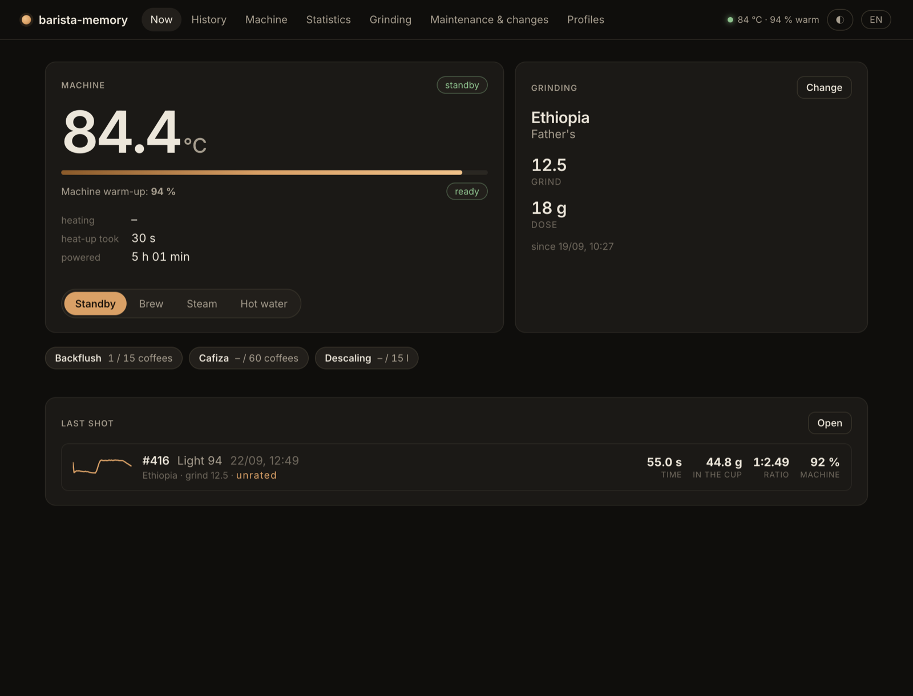
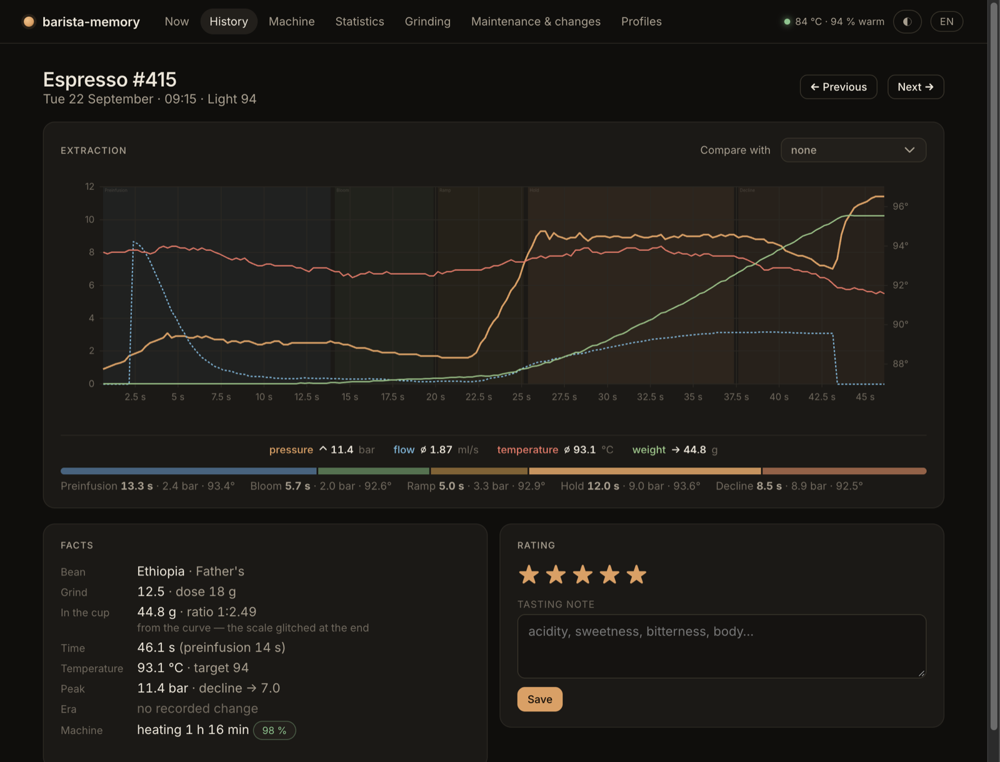
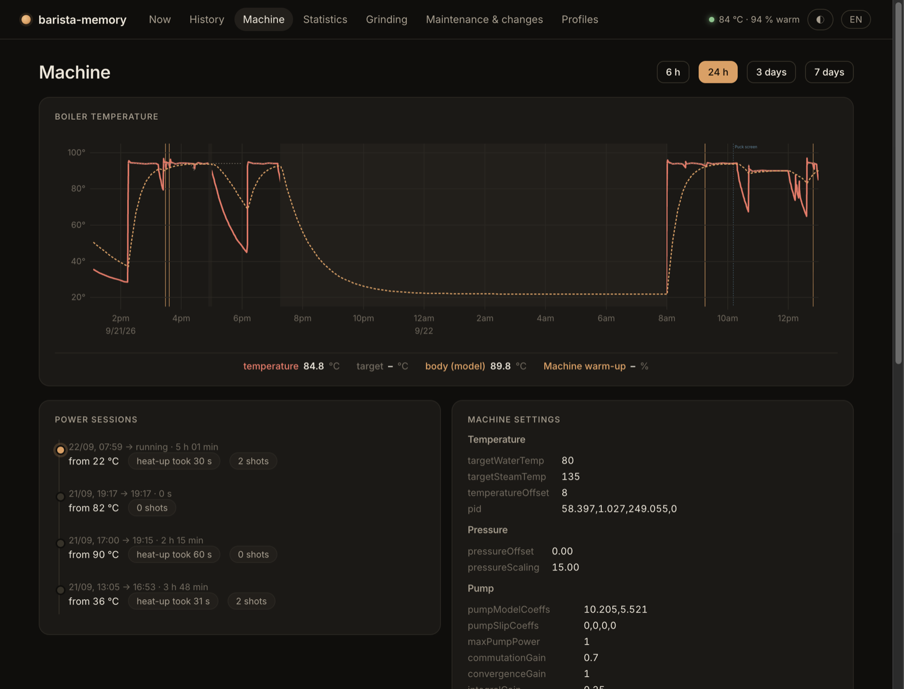

# barista-memory

Remembers what the barista cannot: every shot, the beans and grind in force,
and how warm the machine really was — for a [GaggiMate](https://gaggimate.eu)
espresso machine.



The GaggiMate keeps its shot history in its own flash. barista-memory runs
beside the machine (a Raspberry Pi, a NAS, Home Assistant) and keeps a copy
of every shot in a database you own, with the context the machine cannot
know:

- **Every shot, in your own database.** Raw shot logs are archived as they
  happen and backed up like any file. Nothing is ever re-typed.
- **Beans, grind and dose as periods.** Record a change once; every later
  shot inherits it. Realising the grind changed two shots earlier is one edit.
- **A cup weight you can trust.** The Bluetooth scale corrupts the last
  sample often enough to matter; the archive derives a stable weight and
  ratio from the curve instead of believing the glitch.
- **How warm the machine really was.** The boiler sensor reaches setpoint in
  a minute; the group takes twenty. A thermal model tracks the part the sensor
  cannot see and stores a warm-up percent with every shot.
- **Maintenance that counts itself.** Backflushes are recognised live from the
  machine (the firmware writes no history for them); Cafiza and descaling are
  tracked by coffees and litres of water, with one-click "done".
- **Machine control and profiles.** Standby, brew, steam, hot water; edit
  profiles and set the current one.
- **Home Assistant.** Add-on with ingress, MQTT entities (warm-up, *ready*,
  temperatures, mode select, last shot, maintenance) — "tell me when the
  machine is ready" is one automation.
- **AI assistants.** An MCP server exposes all of it to Claude Code, Claude
  Desktop and other MCP clients.




**Status:** young. Built and used on one Gaggia Classic Pro with GaggiMate
(firmware from September 2026, `.slog` v7). The web UI is in Czech and
English. Issues and shot logs from other machines are welcome.

Copyright © 2026 Jan Müller. Licensed under the **GNU AGPL-3.0**: use it,
change it, run it — and if you ship a changed version, even as a service,
publish your changes under the same terms. See `LICENSE`.

## Install

### Home Assistant add-on

The easiest way if you run Home Assistant: Home Assistant's login in front
of the web UI (ingress), the archive in Home Assistant's backups, MQTT
entities with no configuration when the Mosquitto add-on is installed.

1. Settings → Add-ons → Add-on store → ⋮ → Repositories, add
   `https://github.com/biokys/barista-memory`.
2. Install **Barista Memory**, enter the machine's IP under Configuration,
   start it.
3. It appears in the sidebar.

To use the MCP from your computer, set an **MCP token** under Configuration
and map port 8080 in the Network section; see "Using it from an AI
assistant" below.

### Docker

One image holds the daemon and the web UI; the archive lives in a volume.
Put it on something that stays on — a Raspberry Pi, a NAS, a home server —
so the machine's warm-up is sampled around the clock.

```bash
docker run -d --name barista-memory --restart unless-stopped \
  -p 8080:8080 -v barista-memory:/data \
  -e GAGGIMATE_HOST=192.168.1.50 \
  ghcr.io/biokys/barista-memory
```

Use the machine's IP, not `gaggimate.local`: a container cannot resolve mDNS
names unless it shares the host's network. `docker-compose.yml` in this
repository is the same thing with the settings spelled out. The web UI is
then at `http://<host>:8080` — it has no login of its own, so keep that port
on your LAN. The MCP server runs inside the container too:

```bash
claude mcp add barista-memory -- docker exec -i barista-memory node dist/mcp/server.js
```

Or over the network: set `GAGGIMATE_MCP_TOKEN` and the same tools are served
at `http://<host>:8080/mcp` as Streamable HTTP, for Claude Code, Claude
Desktop or any MCP client on your LAN or VPN:

```bash
claude mcp add barista-memory --transport http http://<host>:8080/mcp \
  --header "Authorization: Bearer <token>"
```

### From source

Needs Node 22.5 or newer (`node:sqlite` is built in — no native modules, so it
builds on an ARM Pi), and a GaggiMate on the same network.

```bash
git clone https://github.com/biokys/barista-memory.git && cd barista-memory
npm ci && npm run build

export GAGGIMATE_HOST=192.168.1.50        # your machine's IP; .local is slow to resolve
export GAGGIMATE_DB=./data/archive.db

npm run cli -- ingest                     # copy every shot the machine holds
npm run cli -- set-setup --bean "Rwanda Kinini" --grind 12.5 --dose 18
npm run cli -- show                       # what context is in force
npm run cli -- status                     # the machine right now
npm run daemon                            # keep going: poll, archive, sample state
```

Run the daemon permanently with `deploy/barista-memory.service` (fill in the
placeholders) on any always-on Linux box — it was built on a Raspberry Pi, but
nothing depends on that — and back the database up with `deploy/backup-db.sh`:
the archive is the only durable copy of your shots.

### Home Assistant entities over MQTT

Set `GAGGIMATE_MQTT_URL` (plus user and password if the broker wants them)
and the daemon publishes a retained state message and Home Assistant
discovery messages, so a **Barista Memory** device appears on its own with
warm-up percent, a *Machine ready* binary sensor (on once the warm-up model
says the group is hot, 85 % by default with hysteresis), boiler and target
temperature, the mode as a sensor and as a select that switches the machine,
the last shot with its context as attributes, and whether maintenance is due.
"Tell me when the machine is ready" is then a one-trigger automation. The
add-on takes the Mosquitto add-on's credentials from the Supervisor, so
there nothing needs configuring.

### Receipt printer

A Bluetooth thermal printer of the MXW01 family ("cat printer", 384 dots
wide) prints a receipt after every coffee: the facts, the pressure and flow
curve with phases, the rating, a greeting and a QR code to the shot. The
receipt is rendered by the archive (`GET /api/shots/:id/receipt.png`, SVG
rasterised in WebAssembly, no native modules) and sent over BlueZ via D-Bus,
so it works from the container and the add-on alike — mount `/run/dbus`
(see `docker-compose.yml`) on a host with Bluetooth. Scan for the printer on
the Machine page, test, switch on "print every shot". `cli print [id]`,
`cli printer-test`, the `print_receipt` MCP tool and a Home Assistant button
entity do the same.

### The web UI

The container serves the web UI on port 8080; from source it is `npm run web`
(`GAGGIMATE_WEB_PORT`). Dark or light, phone-first:
what the machine is doing and how warm it really is, the shot history with a
pressure sparkline per row, a shot detail with every curve and a second shot
overlaid for comparison, the boiler temperature over days, statistics per bean
and per era, and the same "what am I grinding" form as the CLI. Czech and
English, switchable in the header, and the machine's mode (standby, brew,
steam, hot water) switchable from the home page. `deploy/barista-memory-web.service`
runs it permanently from source. **No login of its own** — LAN or VPN only, or
behind Home Assistant's login through ingress.

Besides setups (values that later shots inherit) the UI and the MCP record
**events**: one-off turning points such as a new WDT tool, a puck screen or a
different basket. Every later shot belongs to that event's era, so shots
before and after a change can be compared.

The same screen tracks **maintenance**. Each routine is worn down by
something different, so each is measured in its own unit: backflush and Cafiza
by coffees pulled, descaling (and an optional water filter) by litres of water
the pump moved, the group gasket by days. A backflush is recognised on its own: the firmware
writes no history for a run on a utility profile, so the daemon keeps the
machine's status stream open and logs a backflush when it sees a utility
profile run for more than twenty seconds. (A run on a profile that was not
yet flagged utility is still archived, marked `kind = 'flush'` and kept out of
every coffee statistic.) The machine cannot see whether Cafiza
was in the basket, so one button promotes the last detected flush to a Cafiza
run. Status is computed from the log and the archive, never stored, and the
intervals are yours to change. The home page shows one chip per routine, red
only when overdue.

### Using it from an AI assistant

`src/mcp/tools.ts` holds the MCP tools; `src/mcp/server.ts` serves them over
stdio and the web server serves them at `/mcp` over Streamable HTTP when
`GAGGIMATE_MCP_TOKEN` is set. It reads and writes the
archive, reads the machine's live state, and is the one place that changes
the machine (profiles, mode).

Over HTTP, from any computer on your LAN or VPN (container, add-on or
source alike; set the token first):

```bash
claude mcp add barista-memory --transport http http://<host>:8080/mcp \
  --header "Authorization: Bearer <token>"
```

Clients that only speak stdio can wrap that URL with a local bridge such as
`mcp-remote`. Over stdio, with Claude Code on the box that runs the daemon:

```bash
claude mcp add barista-memory -- \
  env GAGGIMATE_HOST=192.168.1.50 GAGGIMATE_DB=/path/to/archive.db node dist/mcp/server.js
```

or from another machine, over ssh stdio — no port to open:

```bash
claude mcp add barista-memory -- ssh user@pi \
  'cd ~/barista-memory && GAGGIMATE_HOST=… GAGGIMATE_DB=… node --no-warnings dist/mcp/server.js'
```

The tools cover the archive (`query_shots`, `get_archived_shot`, `rate_shot`,
`set_shot_override`), brewing context (`get_current_setup`,
`set_current_setup`, `list_setups`, `move_setup`, `update_setup`), turning
points (`record_event`, `list_events`), machine cleaning
(`maintenance_status`, `record_maintenance`), the machine (`machine_now`,
`machine_timeline`, `machine_temperature_history`, `get_machine_settings`,
`list_profiles`, `get_profile`, `save_profile`, `select_profile`,
`set_machine_mode`) and the archive's own upkeep
(`ingest_now`, `recompute_stable_weights`, `recompute_machine_context`).

### Day to day, from a laptop

`scripts/archive.sh` runs the CLI on the server over ssh (`show`, `status`,
`last`, `set-setup`, `calibrate`, …) and `scripts/deploy.sh` ships a pushed
commit there and restarts the daemon. Both read `.env` — copy `.env.example`.

## Design

### Why this exists

The machine's shot history lives in the machine. This archive lives outside
it — on a Raspberry Pi, a NAS or Home Assistant — in a SQLite file that is
backed up like any other, and it holds the raw log of every shot, so a later
fix to the parser re-derives every shot ever stored.

It also removes the per-shot data entry. Beans, grind setting and dose change
once every many shots, so they are stored as periods rather than as fields on
each shot: record a change once, and every shot pulled afterwards inherits it.

### How the context works

`setups` rows are intervals, each opening at `valid_from`. A shot resolves to
the latest setup that had started by the time it began:

```
setup #1  bean=Kinini grind=3.2 dose=18   valid_from ──┐
                                                       │  shot 405  →  3.2
                                                       │  shot 406  →  3.2
setup #2  grind=3.0 (rest inherited)      valid_from ──┤
                                                       │  shot 407  →  3.0
                                                       │  shot 408  →  3.0
```

Three consequences worth the design:

- **Changing beans does not rewrite history.** Yesterday's shots keep the
  context they were actually pulled under.
- **A correction is one row.** Realising the grind changed before shot 406, not
  after, is an `UPDATE` of one `valid_from`; every affected shot re-derives.
  See `move_setup`.
- **Only what changed is recorded.** Fields left out of a change inherit from
  the previous period, so adjusting the grind does not mean retyping the bean.

A one-off pull that deviated goes in `shot_overrides`, which wins over the
setup for the fields it names. The `shot_context` view joins it all together.

### Two decisions that matter

**Raw `.slog` is stored as a BLOB, not just parsed columns.** This is not
caution for its own sake: the parser vendored here was, at one point, a version
behind the firmware's `.slog` v7 layout and decoded the tail of every shot as
garbage. Because the archive held the original bytes, fixing the parser fixed
every shot already stored — no re-ingest, no data loss. Parsed values are a
cache; the blob is the record.

**Ingest works by set difference, not a high-water mark.** The missing ids are
whatever the device lists and the archive lacks. A gap left by the Pi being down
is filled on the next pass, and a device whose ids restarted after a firmware
update does not silently stop being archived.

### Knowing when the machine was on

The firmware exposes no uptime, no boot time and no heat-up log: `/api/settings`
is configuration, `/api/status` is a live reading, and `evt:status` over the
WebSocket is live too. So the only record that the machine was ever switched on
is one kept from outside.

The daemon samples `/api/status` on every pass into `machine_state`. Two things
make that enough:

- **No answer is the observation.** The machine replies only while it has power,
  so an unreachable poll is how a power-off enters the record — not an error to
  be swallowed. The sample is taken before the ingest and outside its error
  handling for exactly that reason.
- **It heats itself.** After power-on the boiler drives to setpoint without
  being asked, so the temperature curve is a power-on detector, not merely a
  thermometer.

Rows are written on change rather than per poll — dense while the temperature
climbs, sparse while it sits at setpoint — with a heartbeat so a long steady
stretch does not read as a gap. `powerSessions()` reconstructs sessions from
that; its gap threshold is derived from the heartbeat interval, because a
threshold chosen below it turns one quiet session into one session per
heartbeat.

`get_archived_shot` reports how long the machine had been up when a shot was
pulled and whether the boiler had settled. That matters as much as the profile:
a boiler still climbing overshoots, and the curve then shows a shot the profile
never asked for.

### Writing back to the machine

After archiving, the derived context is pushed into the machine's own shot notes
(`req:history:notes:save`), so bean, dose and ratio appear on the machine's Shot
History screen without anyone typing them there.

Two firmware behaviours constrain this, both handled in `notesSync.ts`:

- The save replaces the whole notes object and copies `rating` into the index
  unconditionally, so a partial write clears an existing rating. Existing notes
  are read and merged rather than composed fresh.
- `doseOut` is copied into the index as the shot's volume. That volume is a
  measurement, so it is never sent — only context the machine could not know.

This is convenience, not backup: those notes live in the same flash that an
update clears. The archive is the durable copy.

### Layout

```
src/
  config.ts              environment-driven configuration
  db/schema.sql          tables, the shot_context view, and why each exists
  machineState.ts        sampling the machine's own state; power sessions,
                         operating conditions
  db/db.ts               open, migrate, setup lookup
  device/client.ts       HTTP + WebSocket access to the machine
  device/parsers/        .slog and index.bin parsers (vendored, see below)
  setups.ts              interval logic: record, inherit, correct
  notesSync.ts           push context into the machine's own shot notes
  ingest.ts              one archive pass
  daemon.ts              poll loop (systemd)
  mcp/server.ts          MCP tools: the archive, the machine's live state, and
                         the two things that write to the machine (profiles,
                         settings read)
  mcp/profileSchema.ts   phase schema for save_profile, mirrors the firmware
  device/machineSettings.ts  allowlist for /api/settings (it leaks passwords)
  events.ts              turning points (new tool, technique change) and eras
  maintenance.ts         cleaning routines: intervals, log, status
  flushWatch.ts          logs a backflush from the live status stream
  device/statusStream.ts one persistent WebSocket to the machine's evt:status
  web/server.ts          JSON API + static files for the web UI
  cli.ts                 same operations without an MCP client
web/                     the UI: no build step, ES modules, uPlot, Inter
scripts/archive.sh       runs the CLI on the server over ssh
deploy/                  systemd unit and deployment notes
```

`device/parsers/`, `device/shotTransformer.ts`, `device/machineSettings.ts`
and `mcp/profileSchema.ts` began life in
[gaggimate-mcp](https://github.com/biokys/gaggimate-mcp), whose remaining
tools (profiles, settings) were folded into this server on 2026-09-22 so one
MCP covers both reading the archive and changing the machine. The parsers
mirror the firmware's `shot_log_format.h` — keep them in sync with the device.

`save_profile` merges the caller's fields onto the existing profile before
sending, because the machine replaces the whole profile: editing one phase's
transition must not reset the description or the selected flag.

## Configuration

| Variable | Default | Meaning |
|---|---|---|
| `GAGGIMATE_HOST` | `gaggimate.local` | Machine address. Prefer an IP — mDNS can take seconds. |
| `GAGGIMATE_PROTOCOL` | `ws` | `ws` or `wss`; the HTTP scheme follows. |
| `GAGGIMATE_DB` | `./barista-memory.db` | SQLite file. Put it on storage that outlives the machine. |
| `GAGGIMATE_POLL_INTERVAL` | `30` | Seconds between passes in daemon mode. |
| `GAGGIMATE_TIMEOUT_MS` | `10000` | Per-request timeout against the machine. |
| `GAGGIMATE_SYNC_NOTES` | `1` | `0` leaves the machine's notes untouched. |
| `GAGGIMATE_WEB_PORT` / `GAGGIMATE_WEB_HOST` | `8080` / `0.0.0.0` | Where the web UI and `/mcp` listen. |
| `GAGGIMATE_MCP_TOKEN` | unset | Bearer token for MCP over HTTP at `/mcp`; unset keeps the endpoint off. |
| `GAGGIMATE_MQTT_URL` | unset | `mqtt://host:1883` (or `mqtts://`) for Home Assistant entities; unset = off. |
| `GAGGIMATE_MQTT_USER` / `GAGGIMATE_MQTT_PASSWORD` | unset | Broker credentials. |
| `GAGGIMATE_MQTT_PREFIX` | `barista-memory` | Topic prefix and Home Assistant device id. |
| `GAGGIMATE_HA_DISCOVERY` | `homeassistant` | Home Assistant's MQTT discovery prefix. |
| `GAGGIMATE_READY_PCT` | `85` | Warm-up percent at which *Machine ready* turns on. |
| `GAGGIMATE_PRINTER_MAC` | unset | Bluetooth address of the receipt printer (the UI can override it). |
| `GAGGIMATE_LANG` | `en` | Receipt language, `cs` or `en`. |
| `GAGGIMATE_WEB_URL` | unset | Public base URL of the web UI; receipts then carry a QR code to the shot. |
| `GAGGIMATE_TAU_HEAT_MIN` | `20` | Thermal model: minutes for the group to warm; tune with `cli calibrate`. |
| `GAGGIMATE_ROOM_TEMP_C` | `22` | Thermal model: where a cold machine starts. |
